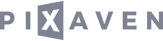

[](https://www.pixaven.com)

<p align="center">
Pixaven is a modern, GPU-powered image processing API.<br>We transform, enhance, adjust, crop, stylize, filter and watermark your images with blazing speed.
</p>

---
<p align="center">
<strong>The official Go integration for the Pixaven API.</strong><br>
<br>


<a href="https://twitter.com/pixaven"></a>
</p>

---

### Documentation
See the [Pixaven API docs](https://docs.pixaven.com/).

### Installation
```bash
$ go get github.com/pixaven/pixaven-go
```

### Quick examples
Pixaven API enables you to provide your images for processing in two ways - by uploading them directly to the API ([Image Upload](https://docs.pixaven.com/requests/image-upload)) or by providing a publicly available image URL ([Image Fetch](https://docs.pixaven.com/requests/image-fetch)).

You may also choose your preferred [response method](https://docs.pixaven.com/introduction#choosing-response-method-and-format) on a per-request basis. By default, the Pixaven API will return a [JSON response](https://docs.pixaven.com/responses/json-response-format) with rich metadata pertaining to input and output images. Alternatively, you can use [binary responses](https://docs.pixaven.com/responses/binary-responses). When enabled, the API will respond with a full binary representation of the resulting (output) image. This Go integration exposes two convenience methods for interacting with binary responses: `.toFile()` and `.toBuffer()`.

#### Image upload
Here is a quick example of uploading a local file for processing. It calls `.toJSON()` at a final step and instructs the API to return a JSON response.

```go
package main

import (
    "fmt"
    "github.com/pixaven/pixaven-go"
)

func main() {
    // Pass your Pixaven API Key to the constructor
    pix, err := pixaven.NewClient("your-api-key")

    if err != nil {
        panic(err)
    }

    // Upload an image from disk, resize it to 100 x 75,
    // automatically enhance, and adjust sharpness parameter.
    meta, err := pix.
        Upload("path/to/input.jpg").
        Resize(pixaven.P{
            "width": 100,
            "height": 75
        }).
        Auto(pixaven.P{
            "enhance": true
        }).
        Adjust(pixaven.P{
            "unsharp": 10
        }).
        ToJSON()

    if err != nil {
        panic(err)
    }

    // You'll find the full JSON metadata within the `meta` variable
}
```

#### Image fetch
If you already have your source visuals publicly available online, we recommend using Image Fetch by default. That way you only have to send a JSON payload containing image URL and processing steps. This method is also much faster than uploading a full binary representation of the image.

```go
package main

import (
    "fmt"
    "github.com/pixaven/pixaven-go"
)

func main() {
    // Pass your Pixaven API Key to the constructor
    pix, err := pixaven.NewClient("your-api-key")

    if err != nil {
        panic(err)
    }

    // Upload an image from disk, resize it to 100 x 75,
    // automatically enhance, and adjust sharpness parameter.
    meta, err := pix.
        Fetch("https://www.website.com/image.jpg").
        Filter(pixaven.P{
            "blur": pixaven.P{
                "mode": "gaussian",
                "value": 10
            }
        }).
        Output(pixaven.P{
            "format": "png"
        }).
        ToFile("path/to/output.png")

    if err != nil {
        panic(err)
    }

    // You'll find the full JSON metadata within the `meta` variable
}
```

### License
This software is distributed under the MIT License. See the [LICENSE](LICENSE) file for more information.

<p align="center"><br><br><a href="https://www.pixaven.com"></a></p>